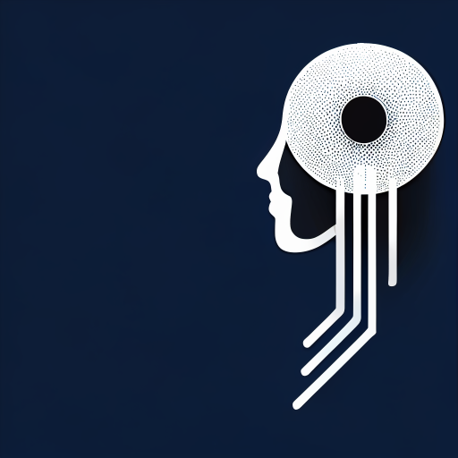

[](https://www.python.org/downloads/release/python-3916/)




### Description
The application processes sound files. Three functions: recognition, enhancement and separation.
The application consists of backend and frontend parts.
#### Frontend
Based on [Streamlit](https://github.com/streamlit/streamlit)
#### Backend
Based on [Fastapi](https://github.com/tiangolo/fastapi)
### Usage
```shell
docker compose up -d --build
```
nginx starts on 80 port

### Backend API Documentation: 
http://0.0.0.0:80/docs/

### Development
Install dev environment:
```shell
pip install -r app/requirements-dev.txt
pip install -r client/requirements.txt
```
Set necessary env variables:
```shell
export APP_PROJECT_NAME='AI Software Engineering'
export AUDIO_RATE=16000
export MAX_FILE_SIZE=1*1024*1024
export API_RECOGNITION_URI=http://0.0.0.0:8000/api/recognize
```
Check flake8:
```shell
flake8 app/
```
Run tests:
```shell
pytest
```
Check tests coverage:
```shell
pytest --cov app
```

### Deploy
```shell
sudo su
```
- [Install docker](https://docs.docker.com/engine/install/ubuntu/)
- [Configure Docker to start on boot with systemd](https://docs.docker.com/engine/install/linux-postinstall/#configure-docker-to-start-on-boot-with-systemd)
- Clone repo:
```shell
sudo git clone https://github.com/brain4power/ai_software_engineering.git /opt/aise
```
- build containers and start application
```shell
cd /opt/aise
docker compose up -d --build
```
- enable the application to run on system boot
```shell
cp configs/prod/aise.service /etc/systemd/system/aise.service
systemctl daemon-reload
systemctl enable aise.service
systemctl start aise.service
```
#### Update server
```shell
sudo su
cd /opt/aise
git pull
docker compose up -d --build
```